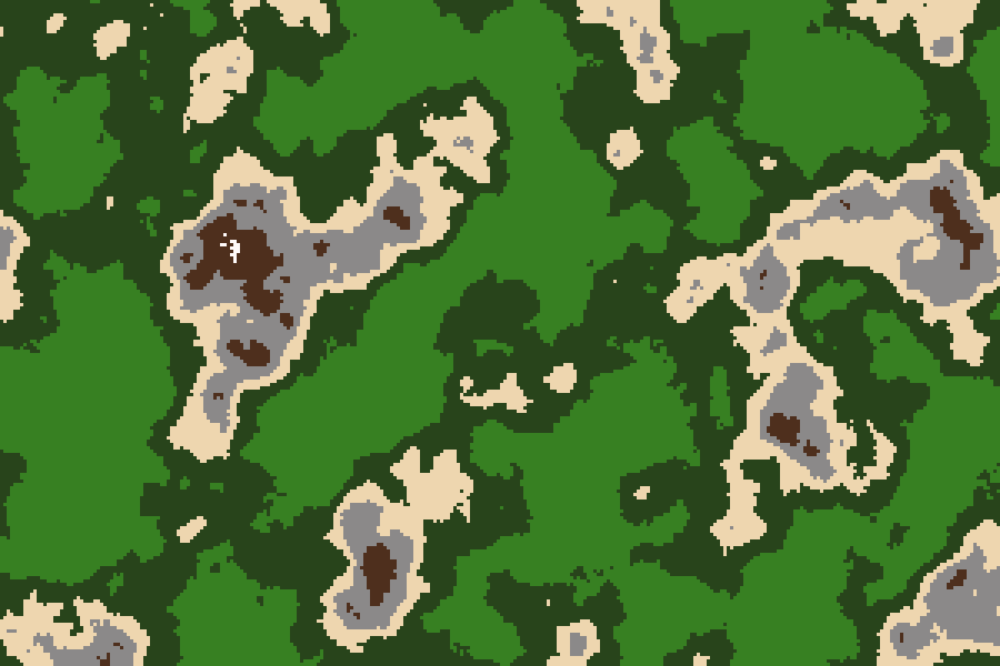
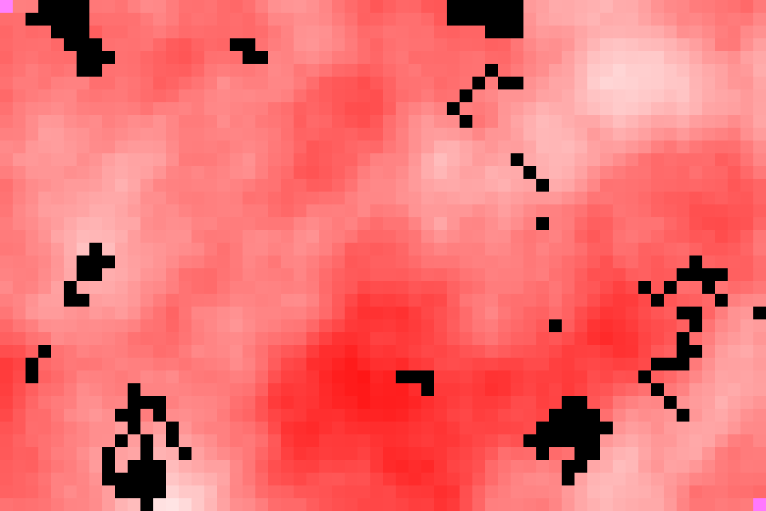
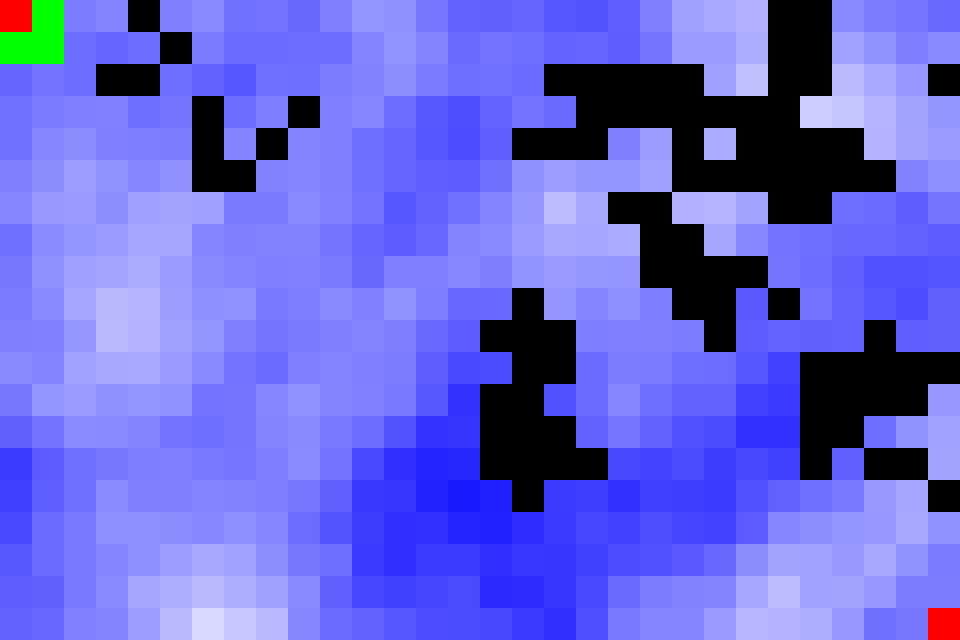

# The Shortest Paths

This is source code for my engineer degree diploma. 

## Representation

Graphs represent Terrain on which we try to find shortest path from point A to B. On the therrrain there are mountains that we are trying to avoid. Mountains are generated via Perlin noise function which quite nicely produces real world looking results:

There are also some walls on the map generated randomly. They represent obstacles that we can't pass and have to go around. On the image bellow mountain height is shown as red and the walls are in black

## Algorithms

I've implemented a couple of algorithms:
 - Greedy
    
 - Dijkstra
    
 - A*
    
 - Shortes Path Ant Colony Optimization (SPACO)
    
 - Bellman-Ford

## Resources
1. Science
    - [Routing Algorithm Based on Ant Colony](https://ieeexplore.ieee.org/abstract/document/7862755)
    - [shortest path computation using Dijkstra](https://ieeexplore.ieee.org/abstract/document/8073641)
    - [A study of stochastic models for the Web Graph](http://www.cs.unibo.it/babaoglu/courses/cas04-05/papers/web-graph.pdf)
    - [Genetic Algorithm](http://datajobstest.com/data-science-repo/Genetic-Algorithm-Guide-[Tom-Mathew].pdf)
    - [Search-Based Optimal Solvers for the MAPP](https://www.aaai.org/ocs/index.php/SOCS/SOCS17/paper/viewFile/15781/15053)
    - [Genetic algorithms](https://towardsdatascience.com/introduction-to-genetic-algorithms-including-example-code-e396e98d8bf3)
    - [Solving a unique Shortest Path problem using Ant Colony Optimisation](https://www.researchgate.net/publication/254455826_Solving_a_unique_Shortest_Path_problem_using_Ant_Colony_Optimisation)
    - [Genetic algorithm with ant colony optimization](https://www.sciencedirect.com/science/article/abs/pii/S1568494606000822)
    - [MAX-MIN Ant System](https://www.sciencedirect.com/science/article/abs/pii/S0167739X00000431?via%3Dihub)
    - [MAX-MIN Ant System alt](https://www.researchgate.net/publication/277284831_MAX-MIN_ant_system)
    - [Perlin Noise Pixel Shaders](https://dl.acm.org/doi/abs/10.1145/383507.383531)
2. Articles
    - [A*-based Pathfinding in Modern Computer Games](https://www.researchgate.net/profile/Xiao-Cui-12/publication/267809499_A-based_Pathfinding_in_Modern_Computer_Games/links/54fd73740cf270426d125adc/A-based-Pathfinding-in-Modern-Computer-Games.pdf)
    - [A* Heuristicsc](http://theory.stanford.edu/~amitp/GameProgramming/Heuristics.html)
    - [Deadlock idea](https://www.frontiersin.org/articles/10.3389/fnbot.2019.00015/full)
    - [Perlin Noise](https://medium.com/@yvanscher/playing-with-perlin-noise-generating-realistic-archipelagos-b59f004d8401)
4. Code
    - [Visualising Graph Data with Python-igraph](https://towardsdatascience.com/visualising-graph-data-with-python-igraph-b3cc81a495cf)
    - [igraph API ](https://igraph.org/python/doc/api/)
    - [igraph tutorial](https://igraph.org/python/doc/tutorial/)
    - [OpenCV-Python tutorial](https://docs.opencv.org/3.4.15/d6/d00/tutorial_py_root.html)
5. Data
    - [Stanford Large Network Dataset Collection](https://snap.stanford.edu/data/)
6. Wikipedia
    - [A* search algorithm](https://en.wikipedia.org/wiki/A*_search_algorithm)
    - [Ant colony algorithm](https://en.wikipedia.org/wiki/Ant_colony_optimization_algorithms)
    - [Dijkstra](https://en.wikipedia.org/wiki/Dijkstra%27s_algorithm)
    - [Shortest Path Problem](https://en.wikipedia.org/wiki/Shortest_path_problem)
7. Other
    - [Ant and Slime simulations](https://www.youtube.com/watch?v=X-iSQQgOd1A)
    